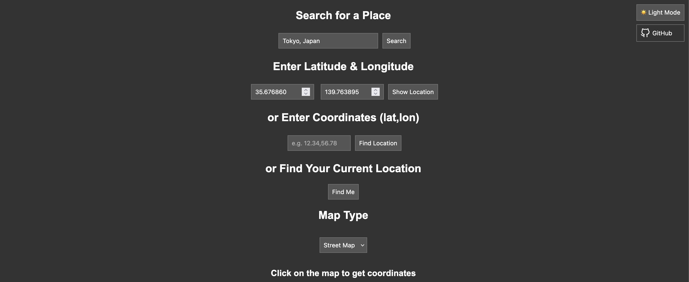

# osm coordinates

app is using:
- OpenStreetMap (street maps + dark)
- Google Maps (satelitte maps)




### \# proxy

By default OSM is **not** using proxy. To enable proxy for outgoing requests:
```
PROXY_ADDR=http://<proxy_ip>:<proxy_port> \
go run .

PROXY_ADDR=socks5://<proxy_ip>:<proxy_port> \
go run .
```


### \# known locations

OSM reads locations from [here](./locations.json). Once server is up and running they are visible (pins) on the map. You can update this file when app is running. New pins will be populated automatically.


### \# logger

Logs (http requests) are kept by default in **/tmp/data/requests.log**
