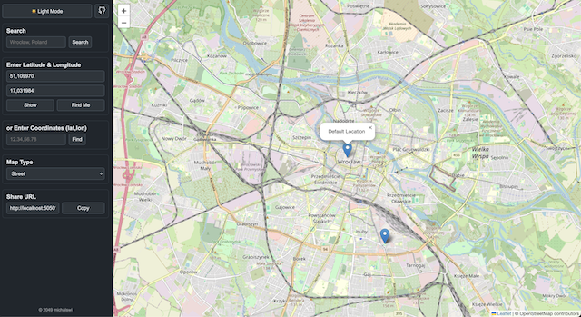

# osm coordinates

app is using:
- OpenStreetMap (street maps + dark)
- Google Maps (satelitte maps)




### \# proxy

By default OSM is **not** using proxy. To enable proxy for outgoing requests:
```
PROXY_ADDR=http://<proxy_ip>:<proxy_port> \
go run .

PROXY_ADDR=socks5://<proxy_ip>:<proxy_port> \
go run .
```


### \# known locations

OSM reads locations from [here](./source/locations.json). Once server is up and running they are visible (pins) on the map. You can update this file when app is running. New pins will be populated automatically.


### \# logger

**http requests** in **json** format are kept by default in (created when oms app started) `/tmp/oms/requests.log`

```
$ cat /tmp/oms_logs/requests.log | jq
[
  {
    "timestamp": "2025-11-20T19:48:30Z",
    "method": "GET",
    "path": "/",
    "query": "",
    "user_agent": "Mozilla/5.0 (Macintosh; Intel Mac OS X 10.15; rv:145.0) Gecko/20100101 Firefox/145.0",
    "remote_addr": "127.0.0.1:57172",
    "x_forwarded_for": "N/A",
    "referer": ""
  }
]
```
