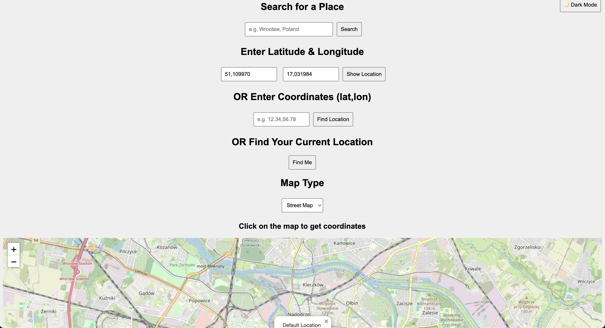

# OpenStreetMap (OSM) coordinates




### \# proxy

By default OSM is not using proxy.  
To enable proxy for outgoing requests to OpenStreetMap, Google Maps:
```
PROXY_ADDR=http://<proxy_ip>:<proxy_port> \
go run .

PROXY_ADDR=socks5://<proxy_ip>:<proxy_port> \
go run .
```


### \# known locations

OSM reads locations from [here](./locations.json). Once server is up and running they are visible (pins) on the map.


### \# logger

Logs (http requests) are kept by default in **/tmp/data/requests.log**
